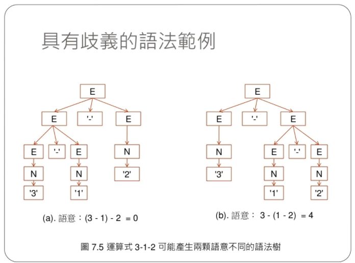
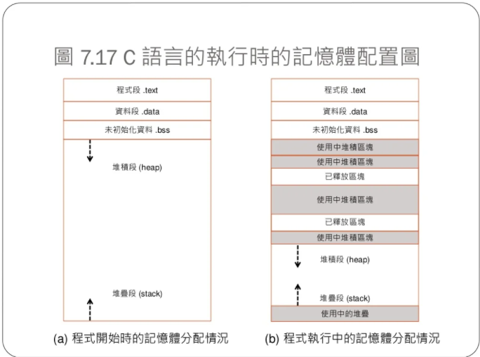
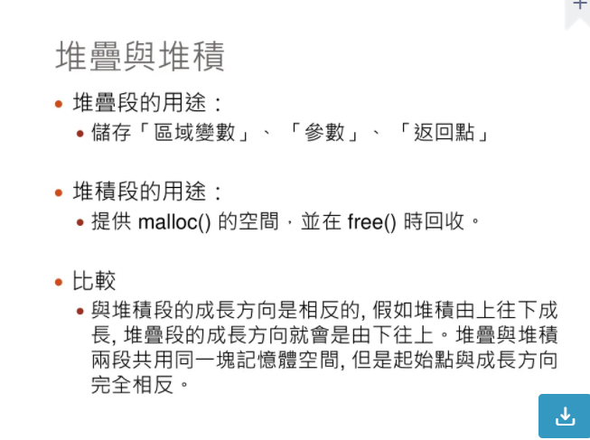

## 高階語言

[系統程式 -- 第 7 章 (slideshare.net)](https://www.slideshare.net/ccckmit/7-73472909)

### 語法理論

程式語言的語法 是利用 生成規則(-> BNF(可能有無窮迴圈),EBNF..)描述的

```c
//EBNF implement
#include <stdio.h>
#include <assert.h>
#include <string.h>
#include <ctype.h>

int tokenIdx = 0;
char *tokens;

int E();
int F();

void error(char *msg) {
  printf("%s", msg);
  assert(0);
}

char ch() {
  char c = tokens[tokenIdx];
  return c;
}

char next() {
  char c = ch();
  tokenIdx++;
  return c;
}

int isNext(char *set) {
  char c = ch();
  return (c!='\0' && strchr(set, c)!=NULL);
}

int nextTemp() {
  static int tempIdx = 0;
  return tempIdx++;
}

void genOp1(int i, char c) {
  printf("# t%d=%c\n", i, c);
  // t1=3 轉成 @3; D=A; @t1; M=D
  // t1=x 轉成 @x; D=M; @t1; M=D
  printf("@%c\n", c);
  char AM = (isdigit(c)) ? 'A':'M';
  printf("D=%c\n", AM);
  printf("@t%d\n", i);
  printf("M=D\n");
}

void genOp2(int i, int i1, char op, int i2) {
  printf("# t%d=t%d%ct%d\n", i, i1, op, i2);
  // t0=t1+t2 轉成 @t1; D=M; @t2; D=D+M; @t0; M=D;
  printf("@t%d\n", i1);
  printf("D=M\n");
  printf("@t%d\n", i2);
  printf("D=D%cM\n", op);
  printf("@t%d\n", i);
  printf("M=D\n");
}

// F =  Number | ID |'(' E ')'
int F() {
  int f;
  char c = ch();
  if (isdigit(c) || (c>='a'&&c<='z')) {
    next(); // skip c
    f = nextTemp();
    genOp1(f, c);
  } else if (c=='(') { // '(' E ')'
    next();
    f = E();
    assert(ch()==')');
    next();
  } else {
    error("F = (E) | Number fail!");
  }
  return f; 
}

// E = F ([+-] F)*
int E() {
  int i1 = F();
  while (isNext("+-")) {
    char op=next();
    int i2 = F();
    int i = nextTemp();
    genOp2(i, i1, op, i2);
    i1 = i;
  }
  return i1;
}

void parse(char *str) {
  tokens = str;
  E();
}

int main(int argc, char * argv[]) {
  printf("=== EBNF Grammar =====\n");
  printf("E=F ([+-] F)*\n");//F = factor
  printf("F=Number | ID |'(' E ')'\n");
  printf("==== parse:%s ========\n", argv[1]);
  parse(argv[1]);
}

```


根據生成規則 -> 語法樹

對語法樹 解譯or編譯

歧異性是不好的

因為會導致同樣的程式碼 有不一樣的結果




.bss 是 **ex**:創一個int陣列但沒有初始化 而那個陣列放的位置



