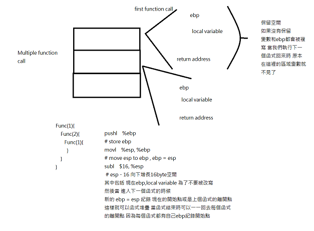

when we call function **foobar**

```
int foobar(int a, int b, int c)
{
    int xx = a + 2;
    int yy = b + 3;
    int zz = c + 4;
    int sum = xx + yy + zz;

    return xx * yy * zz + sum;
}

int main()
{
    return foobar(77, 88, 99);
}
```

we first send the parameters , send return address and then save one ebp(for recursion), it is used to prevent we mess up stack

we can also know that one interger type is 4 bytes


圖片自:[68747470733a2f2f656c692e746865677265656e706c6163652e6e65742f696d616765732f323031312f30322f737461636b6672616d65312e706e67 (252×313) (gitlab-static.net)](https://user-content.gitlab-static.net/7145bf2b3361a9caeb6d6efdea38e7e73ce627a2/68747470733a2f2f656c692e746865677265656e706c6163652e6e65742f696d616765732f323031312f30322f737461636b6672616d65312e706e67)


```
    .file    "foobar.c"
    .text
    .globl    _foobar
    .def    _foobar;    .scl    2;    .type    32;    .endef
_foobar:
# 進入函數前置堆疊操作
    pushl    %ebp     # // $number is literailly number but without $ just number is address
    movl    %esp, %ebp     #,
    subl    $16, %esp     #, // why 16 is because one interger type is 4 byte and we have 3 parameters and one return address  
# int xx = a + 2;
    movl    8(%ebp), %eax  # a, tmp95  # eax = a
    addl    $2, %eax       #, tmp94    # eax = eax + 2
    movl    %eax, -4(%ebp) # tmp94, xx # xx = eax
# int yy = b + 3;
    movl    12(%ebp), %eax # b, tmp99  # eax = b
    addl    $3, %eax       #, tmp98    # eax = eax + 3
    movl    %eax, -8(%ebp) # tmp98, yy # yy = eax
# int zz = c + 4;
    movl    16(%ebp), %eax # c, tmp103  # eax = c 
    addl    $4, %eax       #, tmp102    # eax = eax + 4
    movl    %eax, -12(%ebp) # tmp102,zz # zz = eax
# int sum = xx + yy + zz;
    movl    -4(%ebp)/*xx address*/, %edx # xx, tmp104  # edx = xx 
    movl    -8(%ebp), %eax # yy, tmp105  # eax = yy
    addl    %eax, %edx # tmp105, D.1501  # edx = edx + eax 
    movl    -12(%ebp), %eax # zz, tmp109 # zz = eax
    addl    %edx, %eax  # D.1501, tmp108 # eax = eax + edx
    movl    %eax, -16(%ebp)/*sum address*/ # tmp108,sum # sum = eax
# return xx * yy * zz + sum;
    movl    -4(%ebp), %eax     # xx, tmp110 # eax = xx
    imull    -8(%ebp), %eax    # yy, D.1501 # eax = eax * yy
    imull    -12(%ebp), %eax   # zz, D.1501 # eax = eax * zz
    movl    %eax, %edx     # D.1501, D.1501 # edx = eax
    movl    -16(%ebp), %eax   # sum, tmp111 # sum = eax
    addl    %edx, %eax     # D.1501, D.1501 # eax = edx + eax
# 離開前的後置堆疊處理動作
    leave  // 恢復ebp and 框架站存地
    ret // return to return address next line
    .def    ___main;    .scl    2;    .type    32;    .endef
    .globl    _main
    .def    _main;    .scl    2;    .type    32;    .endef
_main:
    pushl    %ebp     #// push epb
    movl    %esp, %ebp     #, //move esp to ebp
    andl    $-16, %esp     #,// esp + - 16
    subl    $16, %esp     #,// esp - 16
    call    ___main      #
    movl    $99, 8(%esp) #, 把 99 傳給 c
    movl    $88, 4(%esp) #, 把 88 傳給 b
    movl    $77, (%esp)  #, 把 77 傳給 a
    call    _foobar      #  呼叫 foobar (a=77,b=88,c=99)
    leave
    ret
    .ident    "GCC: (tdm-1) 5.1.0"
```

same code in linux

```assembly
.file   "foobar.c"
        .text
        .globl  foobar
        .type   foobar, @function
foobar:
.LFB0:
        .cfi_startproc
        pushq   %rbp
        .cfi_def_cfa_offset 16
        .cfi_offset 6, -16
        movq    %rsp, %rbp
        .cfi_def_cfa_register 6
        movl    %edi, -20(%rbp)
        movl    %esi, -24(%rbp)
        movl    %edx, -28(%rbp)
        movl    -20(%rbp), %eax
        addl    $2, %eax
        movl    %eax, -4(%rbp)
        movl    -24(%rbp), %eax
        addl    $3, %eax
        movl    %eax, -8(%rbp)
        movl    -28(%rbp), %eax
        addl    $4, %eax
        movl    %eax, -12(%rbp)
        movl    -8(%rbp), %eax
        movl    -4(%rbp), %edx
        addl    %eax, %edx
        movl    -12(%rbp), %eax
        addl    %edx, %eax
        movl    %eax, -16(%rbp)
        movl    -4(%rbp), %eax
        imull   -8(%rbp), %eax
        imull   -12(%rbp), %eax
        movl    %eax, %edx
        movl    -16(%rbp), %eax
        addl    %edx, %eax
        popq    %rbp
        .cfi_def_cfa 7, 8
        ret
        .cfi_endproc
.LFE0:
        .size   foobar, .-foobar
        .section        .rodata
.LC0:
        .string "r=%d\n"
        .text
        .globl  main
        .type   main, @function
main:
.LFB1:
        .cfi_startproc
        pushq   %rbp
        .cfi_def_cfa_offset 16
        .cfi_offset 6, -16
        movq    %rsp, %rbp
        .cfi_def_cfa_register 6
        subq    $16, %rsp
        movl    $99, %edx
        movl    $88, %esi
        movl    $77, %edi
        call    foobar
        movl    %eax, -4(%rbp)
        movl    -4(%rbp), %eax
        movl    %eax, %esi
        movl    $.LC0, %edi
        movl    $0, %eax
        call    printf
        leave
        .cfi_def_cfa 7, 8
        ret
        .cfi_endproc
.LFE1:
        .size   main, .-main
        .ident  "GCC: (GNU) 4.8.5 20150623 (Red Hat 4.8.5-44)"
        .section        .note.GNU-stack,"",@progbits

```

設定新的ebp 保留區域變數空間

如果不保留的話	問題不大 因為沒有遞迴

但如果有遞迴的話 上一個變數會被複寫 也就是說 如果我們這個函數有很多區域變數 呼叫下一個 subroutine 她保留空間會增加



## inline ASM

```C
#include <stdio.h>
#include <stdint.h>

int main(int argc, char **argv)
{
    int32_t var1=10, var2=20, sum = 0;
    asm volatile ("addl %%ebx,%%eax;"
                 : "=a" (sum)              /* output: sum = EAX */
                 : "a" (var1), "b" (var2)  /* inputs: EAX = var1, EBX = var2 */
    );
    printf("sum = %d\n", sum);
    return 0;
}

```

可以讓C語言與 組合語言結合


## obj dump

反組義 轉機器碼


透過nmap 然後設定記憶體可執行 就可以把機器碼執行 (jitFib && jitAdd) 


```C
// https://github.com/spencertipping/jit-tutorial/blob/master/jitproto.c

// jitproto.c
#include <stdio.h>
#include <stdlib.h>
#include <sys/mman.h>

typedef long(*fn)(long);

fn compile_identity(void) {
  // Allocate some memory and set its permissions correctly. In particular, we
  // need PROT_EXEC (which isn't normally enabled for data memory, e.g. from
  // malloc()), which tells the processor it's ok to execute it as machine
  // code.
  char *memory = mmap(NULL,             // address
                      4096,             // size
                      PROT_READ | PROT_WRITE | PROT_EXEC,
                      MAP_PRIVATE | MAP_ANONYMOUS,
                      -1,               // fd (not used here)
                      0);               // offset (not used here)
  if (!memory) {
    perror("failed to allocate memory");
    exit(1);
  }

  int i = 0;

  // mov %rdi, %rax
  memory[i++] = 0x48;           // REX.W prefix
  memory[i++] = 0x8b;           // MOV opcode, register/register
  memory[i++] = 0xc7;           // MOD/RM byte for %rdi -> %rax

  // ret
  memory[i++] = 0xc3;           // RET opcode

  return (fn) memory;
}

int main() {
  fn f = compile_identity();
  int i;
  for (i = 0; i < 10; ++i)
    printf("f(%d) = %ld\n", i, (*f)(i));
  munmap(f, 4096);
  return 0;
}

```


```assembly
// mov %rdi, %rax
```

rax 就是函數的傳回值

而 rdi 就是函數的第一個參數 這是固定的(x86) == 直接return 第一個參數

result:

```
$ wsl
wsl> gcc jit1.c -o jit1
wsl> ./jit1
f(0) = 0
f(1) = 1
f(2) = 2
f(3) = 3
f(4) = 4
f(5) = 5
f(6) = 6
f(7) = 7
f(8) = 8
f(9) = 9

```
