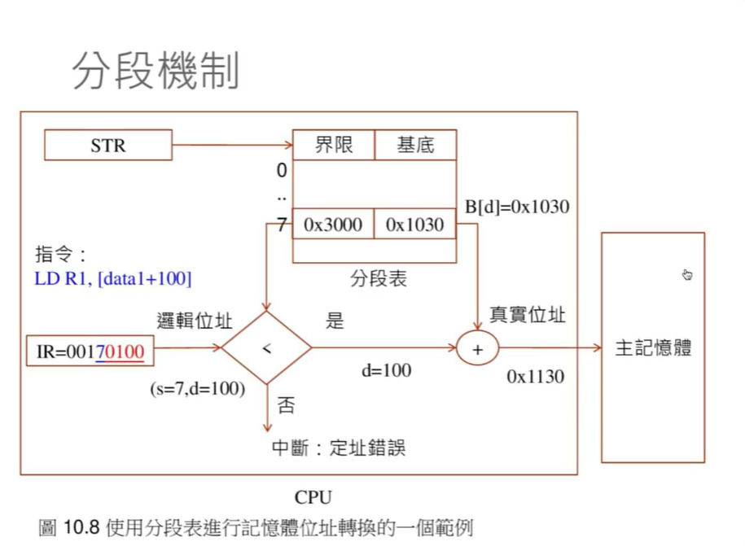

## Operation System


功能: 

* 行程管理	一個環境讓任何程式都能輕易的執行  讓整個記憶體就像是給使用者使用 (實則不然 他使用 硬體 MU(memory management unit記憶體管理單元)  透過MU 可以讓記憶體位置,邏輯位置,映射到整台電腦的記憶體範圍 映射完後 會到實體位置 這才是真正的記憶體 所以使用這種方式 可以讓使用者 看到邏輯位置 像是整台電腦記憶體都是給使用者的 但是在實體位置上其實不然)多工  當點下exe檔案 原本在硬碟中的執行檔就會被載入帶記憶體執行 而這個正在執行的東西 就是 行程 

* 記憶體管理 方便的記憶體配置環境 (ex : C malloc  malloc 是從heap去分配一塊記憶體 而另一種是透過MMU)
* 輸出入系統 不需要面對多樣複雜的環境(ex想要存取硬體 呼叫硬碟 寫進哪個磁軌  => 把它抽象畫 變成叫做檔案和資料夾的結構 會簡單許多 只要呼叫作業系統的功能 告訴他說要開啟哪個資料夾底下檔案 或是增加 刪除 修改她等等 像 open,fopen read,fread, write ,fwrite C語言檔案相關的函示庫都是把作業系統的檔案功能的函示庫在做一層包裝而形成的)
* 檔案系統 其實是輸出入系統的一層抽象 這個抽象使得 不管事硬碟軟碟或是光碟 都可以把它當作倘案系統的一部分 寫程式只需要透過作業系統檔案輸出入函數就可以輕易存取
* 使用者介面


多工:  同時執行多個程式的能力


(A) 像是 arduino


行程模式: CPU 和 輸出入


因為這樣的設計 當在輸出入時 不會搶著CPU 他可以去做其他事


那麼如果行程進入 無窮迴圈? 

利用中斷機制避免 作業系統將CPU交給一個行程之前會先設定中斷時間點 以便當行程 霸佔CPU時 作業系統可以透過中斷把CPU搶回來

行程就是執行中的程式


就緒狀態的時候不見得 就以得到CPU馬上執行 可能要等待其他行程執行 等待排程器來分派 如果他執行太九執行中斷器發生 那麼他又會回到就緒的狀態 等待下去被分派到CPU

那麼如果他不是被時間中斷中斷 而是他做了輸出入的動作 那只要一進入輸出入就會進到等待狀態 然後再到就緒 在等待被分派到CPU


排程問題

* 哪個行程要先被執行?
* 下一個應該執行的行程是什麼?

這個是作業系統效能的關鍵


排程方法

* FCFS(first come, first served)
* SJF (shortest job first(預估最短 應該程式根本還沒執行))
* SRF (shortest remaining first 跟上一個一樣要預估的 不一定真的最少)
* PS(priority scheduling)
* RR (round-robin scheduling 最常見 使用時間中斷 去跑另一個 大家盡可能的公平輪流循環 先為行程是先分配一個時間片段T(Time Slice) 才切換到該行程 一但時間用完 發生中斷 下一個行程 剛上面的一樣 當執行無窮迴圈的行程 他會中斷 可以點螢幕做其他事等等 不會被行程卡死)


內文切換 可是就算搶到CPU 我們還要有切換行程內容這個動作 而這個動作很常發生 所以要十分有效率 會進行到大量暫存器的存取 通常用組合語言撰寫 => 所以code is platform specific


行程的資料共享 通常一個程式都是一個行程 但也可以分裂出許多行程 但即便如此 各個行程之間都是獨立執行不會共享資料

可是 如果想要兩個行程做某種通訊或共享資料的功能

在Linux Unix IPC(interprocess communication) 這像的功能可以讓行程共享資料

另一個是比行程更細微的 叫做Thread 如果用Thread的話就可以共用記憶體 達到共用變數


Thread

稱為輕量級行程 (light weighted process)

他們之間可以共用記憶體 

切換的時候只需要保存暫存器 所以切換的時候比較快


Process vs Thread

兩個行程有兩個不同的記憶體空間 有記憶體管理單元MMU會切換分頁表 所以兩個 記憶體空間會完全獨立 各自擁有自己的記憶體映射表 

兩個Thread 基本上就是同時在執行兩個函數 所以想要傳訊息要給Thread 只要寫入共用變數就好了 切換的時候不需要切換MMU的分頁表


Thread code(compile gcc filename.c -o filename -lpthread)

```c
#include<pthread.h>
#include<stdio.h>
#include<unistd.h>
void* print_mary(void* argu){
    while(1){
        printf("mary\n");
        sleep(1);
    }
    return NULL;
}

void* print_brain(void* argu){
    while(1){
        printf("brain\n");
        sleep(3);
    }
    return NULL;
}

int main(){
    pthread_t thread1, thread2;

    pthread_create(&thread1, NULL, &print_mary,NULL);
    pthread_create(&thread2, NULL, &print_brain,NULL);
    while(1){

    }
}
```


行程是個單獨的程式


放三個 forever在背景執行 互相獨立


Thread 的話每個函數在執行時 另一個函數也在執行 他們可以共用東西 == 執行中的函數而不是程式

剛剛上面的Thread code 可以說有三個東西在執行 兩個thread 一個主程式


Thread 問題

競爭問題 vs 臨界區間

如果有兩個 thread 同時修改變數值 假如要同時 修改共用X變數 thread1 修改為X1 thread2 修改為X2 那麼答案可能X1,X2甚至是其他值('Cuz: 在組合語言中 就算只有一條修改的指令 但可能被分為好幾個指令 那麼當你同時修改指令可能交錯執行... ) 這樣不確定的情況是競爭狀況 而修改的共用變數區段被稱為 臨界區間

而競爭情況是很糟糕的 因為不確定性 所以 我們把這些程式區段 臨界區間 要保護他們 讓她不會同時去修改同個變數 而保護方法是


臨界區間保護

pthread_mutex_lock

互斥瑣 迫使他不要同時使用那個共用變數


互斥瑣作法

* 禁止中斷(單核心) 在CPU0中 有個I,T旗標 設定他們可以禁止中斷行為
* 支援同步硬體 (號誌)

[Mutex 與 Semaphore 最大的差異是 | Jason note (jasonblog.github.io)](https://jasonblog.github.io/note/linux_system/mutex_yu_semaphore_zui_da_de_cha_yi_shi.html)

互斥瑣和號誌問題

* deadlock

```c
#include<pthread.h>
#include<stdio.h>
#include<unistd.h>
pthread_mutex_t x;
pthread_mutex_t y;

void* lockA(void* argu){
    pthread_mutex_lock(&x);
    printf("lock x\n");
    sleep(1);
    pthread_mutex_lock(&y);
    printf("lock y\n");
    sleep(1);
    pthread_mutex_unlock(&x);
    pthread_mutex_unlock(&y);
    return NULL;
}

void* lockB(void* argu){
    pthread_mutex_lock(&y);
    printf("lock y\n");
    sleep(1);

    pthread_mutex_lock(&x);
    printf("lock x\n");
    sleep(1);
    pthread_mutex_unlock(&y);
    pthread_mutex_unlock(&x);
    return NULL;
}

int main(){
    pthread_t thread1, thread2;
    pthread_attr_t attr;
    pthread_attr_init(&attr);
    pthread_mutex_init(&x,NULL);
    pthread_mutex_init(&y,NULL);

    pthread_create(&thread1, &attr, lockA,NULL);
    pthread_create(&thread2, &attr, lockB,NULL);

    pthread_join(thread1,NULL);
    pthread_join(thread2,NULL);

    pthread_mutex_destroy(&x);
    pthread_mutex_destroy(&y);
}

```


作業系統不處理死結問題 因為解決的辦法都回影響到作業系統 有不好的效果


famous question:

哲學家用餐問題


Thread 應用

* 爬蟲

### 記憶體管理

記憶體分配回收

分配方法

* First Fit
* Nest-Fit (常用)
* Best-Fit
* Worst-Fit

函示庫支援找不到足夠空間

* report error
* try fix
  * garbage collection algorithm(高階語言使用 ex: javascript python)
  * memory compaction (記憶體重新搬動合併 耗時)


作業系統支援 跟硬體MMU有關


MMU:

* 重定位暫存器 邏輯位置是0x0312如果沒有使用重訂為暫存器(基底暫存器 他設定一個基底(base)後 他把base設定到程式被載到主記憶體的位置 => 可以放到任何地方只要設定好base 就可以跑)這個位置是寫死的 程式不能搬動到其他地方    

  問題: 他只有基底沒有被存取的區塊範圍 所以在多工作業系統的情況下 多個程式在執行的時候 他只要存取超過範圍的時候可能存取到別人的資料 就會有安全性的顧慮 

  

* 基底界限暫存器  有基底還有界限 不會存取到別人資料
* 分段表    很多個基底和界限暫存器 每個都有自己的基底和界限暫存器 ,  一個程式就有好幾組基底和界限暫存器 ex: 程式段 資料段 堆疊段...  設定說不可以修改程式段的東西 可以用分段的機制限制這樣的事情
* 分頁表 IR(指令) 會有兩個位置 p頁代碼,d位移代碼 兩個合起來才是真正的位移  頁代碼會指向方頁表 位移代碼會加上去 得到真正的記憶體位置 而分頁表上面會有TLB 去對映邏輯頁如何對應到實體頁 如果TLB命中就可以直接取得  而因為TLB是放在硬體的快取記憶體 速度快 如果TLB沒有命中 他會去 分頁表裡面找 (分頁表也是放在記憶體裡面 所以速度比較慢 => 如果每次都去分頁表找 速度變慢 所以才需要TLB 像是快取那樣)


驅動程式

​	一但有輸出入系統和檔案系統 要加掛其他的裝置進去就需要有驅動程式這樣的機制 讓他加掛

驅動程式 會把函數指標傳給作業系統 然後有輸出入需求的時後再去呼叫這些函式 這個行為就做 callback(跟js的一樣)機制


Linux 系統架構


VFS 虛擬檔案介面


Linux行程管理

行程管理:

使用fork()分叉出新行程(父子 => 原本的行程 和一個新的行程)

**Example** 

```c
#include<stdio.h>
#include<unistd.h>//linux fucntion
int main(){
	if(fork() == 0){
        printf("I'm child");
    }else printf("I'm parent");
}
```

>  zombie
>
> 雖然子行程已經結束了 但因為 父行程 還沒結束 子行程變成了殭屍 佔用空間等待父結束

```c
//zombie
#include <unistd.h>
#include <stdio.h>
#include <stdlib.h>
#include <sys/types.h>

int main(void)
{
        pid_t pid;

        printf("parent : %d\n", getpid());

        pid = fork();

        if (pid == 0) {
                printf("child : %d\n", getpid());
                sleep(2);
                printf("child exit\n");
                exit(1);
        }

        /* in parent */
        while (1)
        {
                sleep(1);
        }
}

```

> orphan process
>
> 就是跟zombie 相反 父行程已經結束 但子行程還沒結束, 之後可能被 systemd 或是 init接收變成他的父行程(就是第一個執行的行程, pid = 1的行程)

使用execvp(prog,arg_list)將新行程替換成另一個程式

**Example System call**

```c
#include  <stdio.h>
#include  <sys/types.h>

void  parse(char *line, char **argv)
{
     while (*line != '\0') {       /* if not the end of line ....... */ 
          while (*line == ' ' || *line == '\t' || *line == '\n')
               *line++ = '\0';     /* replace white spaces with 0    */
          *argv++ = line;          /* save the argument position     */
          while (*line != '\0' && *line != ' ' && 
                 *line != '\t' && *line != '\n') 
               line++;             /* skip the argument until ...    */
     }
     *argv = '\0';                 /* mark the end of argument list  */
}

void  execute(char **argv)
{
     pid_t  pid;
     int    status;

     if ((pid = fork()) < 0) {     /* fork a child process           */
          printf("*** ERROR: forking child process failed\n");
          exit(1);
     }
     else if (pid == 0) {          /* for the child process:         */
          if (execvp(*argv, argv) < 0) {     /* execute the command  */
               printf("*** ERROR: exec failed\n");
               exit(1);
          }
     }
     else {                                  /* for the parent:      */
          while (wait(&status) != pid)       
              /*
              wait for completion, wait把子行程退出時的狀態取出放在status， 这是一個int
              ex: .....exit(5); status == 5
              */ 
               ;
     }
}

void  main(void)
{
     char  line[1024];             /* the input line                 */
     char  *argv[64];              /* the command line argument      */

     while (1) {                   /* repeat until done ....         */
          printf("Shell -> ");     /*   display a prompt             */
          gets(line);              /*   read in the command line     */
          printf("\n");
          parse(line, argv);       /*   parse the line               */
          if (strcmp(argv[0], "exit") == 0)  /* is it an "exit"?     */
               exit(0);            /*   exit if it is                */
          execute(argv);           /* otherwise, execute the command */
     }
}
```


執行緒:

使用pthread library

使用ptreahd_create() 建立新執行緒

使用sleep() 暫停一段時間


Linux 記憶體管理

分段式分頁


比較有效的記憶體分配架構 : buddy system


